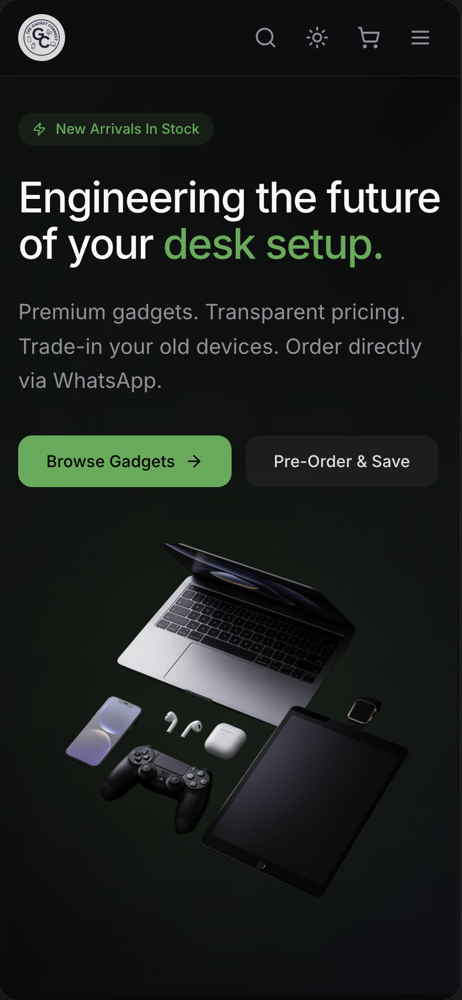
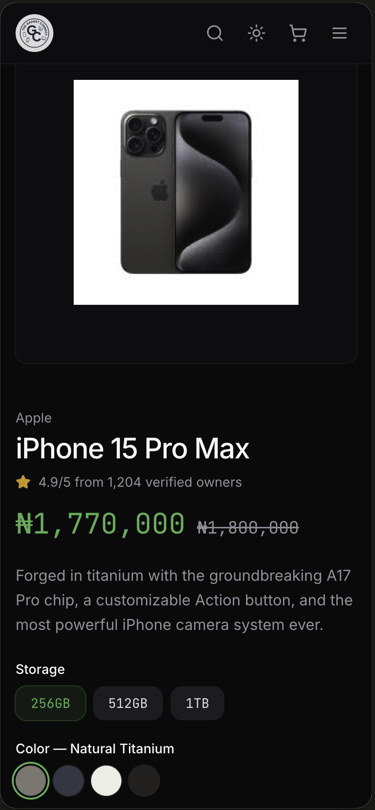
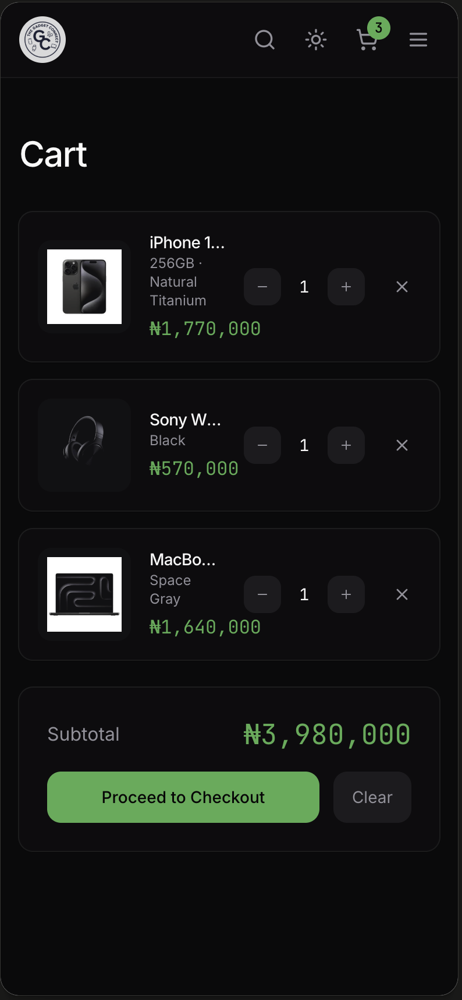
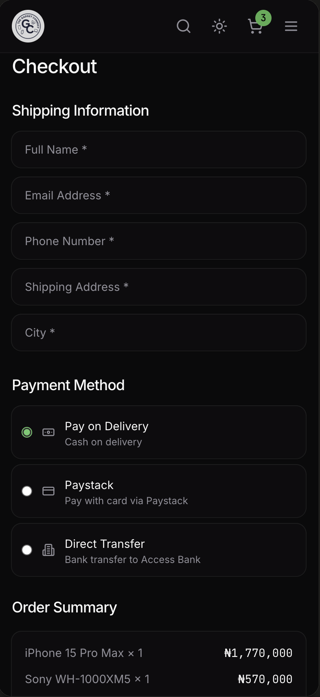

# Gadget Connect

A full-stack gadget marketplace designed to help users discover, purchase, sell, trade, and pre-order consumer electronics.

## Overview

Gadget Connect was created as a marketplace concept for people looking to buy or sell gadgets through a single platform.

The application combines product browsing, shopping, cart and checkout functionality with backend services for order management, payment processing, and automated email communication.

## Key Features

- 🛍️ Product browsing and discovery
- 🔎 Product search and filtering
- 🛒 Shopping cart
- 💳 Checkout and payment-method selection
- 📦 Order creation and order management
- 💰 Payment verification
- 📧 Automated order and contact emails
- 👤 Customer information and account functionality
- 🔄 Gadget selling and trading concepts
- 📋 Gadget pre-order functionality
- ❤️ Wishlist/favorite concepts
- 📱 Responsive user interface

## How It Works

1. Users browse available gadgets and view product information.
2. Products can be added to the shopping cart.
3. Users proceed through checkout and provide their customer information.
4. An order is created and stored in the backend.
5. The selected payment method can be processed and verified.
6. Customers can receive automated email notifications related to their orders.

## Technology Stack

- **Frontend:** React, TypeScript
- **Styling:** Tailwind CSS
- **Backend & Database:** Supabase, PostgreSQL
- **Server-side Logic:** Supabase Edge Functions
- **Payments:** Paystack
- **Email:** Resend
- **Development:** Vite, Git, GitHub

## Backend & Security

The project includes backend functionality for handling customer orders and payment-related operations.

During development, I worked with:

- Database tables and migrations
- Row Level Security (RLS)
- Input validation
- Data sanitization
- Payment verification
- Server-side order creation
- Rate limiting
- Protected database operations
- Automated email workflows

The project also involved improving database access policies and tightening backend validation as the application developed.

## Project Highlights

This project involved more than creating a storefront interface. I conceived the marketplace idea, defined its core functionality and user flows, and used AI-assisted development tools to implement and refine the application.

The project gave me practical experience working with:

- Full-stack web application architecture
- E-commerce workflows
- Database-backed applications
- Authentication and user data
- Backend/server-side functions
- Payment integrations
- API and third-party service integrations
- Database security and access policies
- Validation and data sanitization
- Automated email communication

## Future Improvements

- Expand seller functionality
- Improve product and inventory management
- Add stronger order tracking
- Improve payment verification and transaction validation
- Add more advanced marketplace features
- Expand the trading and pre-order systems
- Improve administrative tools
- Add stronger product recommendation and comparison features

## Project Status

**MVP / Prototype**

The application demonstrates the core marketplace experience and supporting backend functionality. Some marketplace features are represented as product concepts and may require further development for a production-scale platform.

## Author

**Gabriel Ude**

Computer Science Student | Aspiring Full-Stack Developer

GitHub: [Gabriel071207](https://github.com/Gabriel071207)
## Screenshots

<table>
  <tr>
    <td align="center">
      <strong>Marketplace homepage</strong>  
      
    </td>
    <td align="center">
      <strong>Product details</strong>  
      
    </td>
  </tr>
  <tr>
    <td align="center">
      <strong>Shopping cart</strong>  
      
    </td>
    <td align="center">
      <strong>Checkout & payment</strong>  
      
    </td>
  </tr>
</table>
